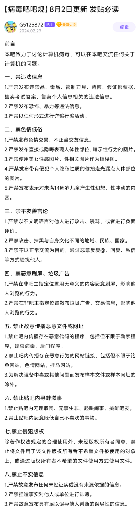
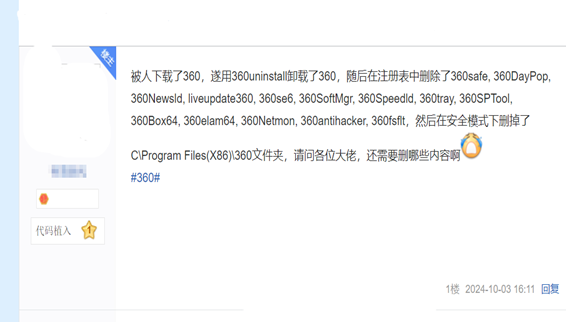

# 病毒吧吧规和一些必要的概念

## 病毒吧吧规

**（吧规真的很简单，简单浏览一遍你就理解了）**

除此之外，本吧严禁未经吧主批准的任何有偿帮助。(如果你确实有能力解决较为复杂的问题，且希望提供收费技术支持，请联系吧主申请）

<strong>病毒吧不提供任何通过</strong><strong>&ldquo;</strong><strong>开盒</strong><strong>&rdquo;</strong><strong>等手段非法获取他人个人信息的服务、指导等，以及危害他人计算机安全的资源提供</strong><strong>/</strong><strong>制作教学，吧内及吧群内均禁聊相关话题！本吧内任何人出现的开盒行为仅有关开盒人自己，本吧决不支持相关行为，并建议受害者进行报警处理。</strong>

## 必要概念

（1）重新启动和关机再开机是不同的，二者的效果不一样。

PS：但如果你关闭了快速启动，效果便会相同。[点击这里学习关闭快速启动](https://faq.ravenote.top/useful_tips/system/3_disable_quick_start.html)

（2）卸载应用程序的正确方法是控制面板或设置卸载，**直接删除文件是不正确的，强制删除也不应当直接用**，详见[此视频](https://www.bilibili.com/video/BV1KN41167JU)。

反例：卸载软件搞的极为复杂（对楼主无恶意，图片隐去其信息，仅做示例）

（3）一台计算机必须安装杀毒软件，而且必须有且仅有**唯一一个**第三方杀毒软件（Windows安全中心不算数，因为它在安装新的杀毒软件后会自动关闭）。

（4）日常使用必须将**计算机安全**放在**第一位**。

（5）重装系统是万不得已的选择，正确的思路是能不重装就不重装。

（6）系统盘中的“Windows”文件夹、“Users”文件夹、“ProgramData”文件夹你不能碰，除非你是专业人员或在专业人员指导下进行操作（包括严格按照文档内指示的要求操作）。

（7）被打成压缩包的程序组，你必须将所有文件全部解压到同一文件夹才能正常使用。**关于压缩和解压请看这个视频**：[【科普】什么是压缩包？怎么用？为什么文件可以被压缩？](https://www.bilibili.com/video/BV1aM4y1H7Su/)

（8）BitLocker对一般用户来说积极意义不大，但是消极意义很大，最好关闭。

参考视频：[如何开启和关闭bitlocker加密](https://www.bilibili.com/video/BV1hm421j7M2/)

（9）系统注册表你不能碰，除非你是专业人员或在专业人员指导下进行操作（包括严格按照文档内指示的要求操作）。

（10）任何杀毒软件都需要联网更新病毒库，你不应在无网络环境下使用杀毒软件。

（11）关于操作系统的设置你不能碰，除非你是专业人员或在专业人员指导下进行操作（包括严格按照文档内指示的要求操作）。

（12）不同系统、不同架构的程序，没法相互直接运行。所以不要问电脑病毒会不会感染手机了。

对电脑病毒不会感染手机更详细的解释，[请点击此处查看](https://faq.ravenote.top/prevention/basic/1_about_prevention.html#%E4%B8%BA%E4%BB%80%E4%B9%88%E7%94%B5%E8%84%91%E7%97%85%E6%AF%92%E4%B8%8D%E4%BC%9A%E4%BC%A0%E6%92%AD%E7%BB%99%E6%89%8B%E6%9C%BA-%E5%8F%8D%E4%B9%8B%E4%BA%A6%E7%84%B6)

还是觉得有可能感染？那看看这个图片。

（13）不乱下载文件和不乱访问网站，不代表病毒不会主动攻击你的电脑。

（14）使用杀毒软件或急救工具解决设备中毒时，你必须无条件相信杀毒软件或急救工具。

（15）防火墙和杀毒软件不是一个东西。

**部分Windows常见操作图解在：[Windows常见操作的图解](https://docs.qq.com/doc/DQXd5UEZacGVsbWFQ)，不会操作可以去看一下。**