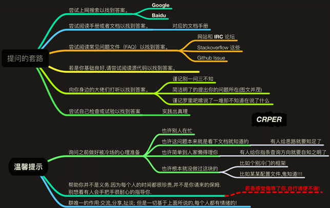
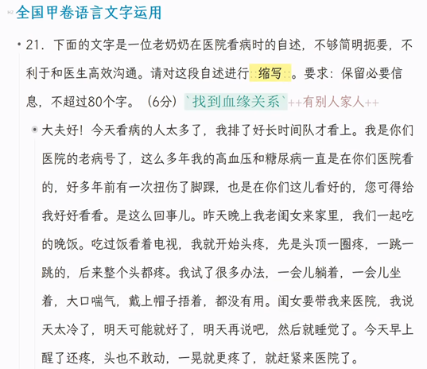

# 病毒吧QQ群

**病毒吧QQ群（群聊加入方式见此项内容最底部的图片，但加群前必须阅读下文中的“（2）如何正确申请加群”，否则过不了进群问题。欢迎求助者和技术大佬加入。）**

## **进群前的准备**

**请先阅读[别像弱智一样提问](https://gitee.com/domeeno/Stop-Ask-Questions-The-Stupid-Ways#https://gitee.com/link?target=https%3A%2F%2Fgithub.com%2Fryanhanwu%2FHow-To-Ask-Questions-The-Smart-Way%2Fblob%2Fmaster%2FREADME-zh_CN.md)和[提问的智慧](https://lug.ustc.edu.cn/wiki/doc/smart-questions/)以确保有效提问，简单来说:**

下面的图片则可以类比一下，作为一个求助时的**反例**

同时可观看这些视频： 

1、[【【吐槽】为什么有些小白会挨骂？】](https://www.bilibili.com/video/BV18emSYSEct/) 

2、[【吐槽】为什么很多人不喜欢当代小白？真的是因为厌蠢症吗？](https://www.bilibili.com/video/BV1fYx9egEeP/) 

**(再次重申!!!毒吧任何人不提供开盒服务/技术支持/教学以及病毒资源提供/制作教学，吧内及吧群内均禁聊相关话题！毒吧内任何人出现的开盒行为仅有关开盒人自己，毒吧不代表，不支持，不赞同，不鼓励相关行为，并建议受害者进行报警处理）**

**（2）如何正确申请加群**

**加群时特别注意，加群问题一共有3个：加群前2个问题，加群后1个问题。**

## **加群前的2个问题**

**加群前的问题有2个，它们是： “ 你加群的目的是什么？你有没有充分阅读该文档？ ”。请认真回答加群问题(同时按照导航最开头要求看完文档至少一部分)，否则我们将有权拒绝你的加入。（只要你答的合理我们就会给过的，不必当做面试那么写很长理由严肃回答，但别把你要问的贼长的问题写进入群问题答案里！）**

**提示：怕有人看不明白，这里再补充一下，对于加群前第一个问题，如果你的电脑问题很长，你可以简单写出问题现象等，或者直接说“遇到电脑问题”，等进入群聊后再提供详尽的描述**

**✓ 一例正例（入群问题回答）：**

``因电脑蓝屏死机原因求助，已按要求阅读文档；（简要说明进群理由）``

**✖ 一例反例（答非所问）：**

## **加群后的1个问题**

**加群后的问题有1个。**进群之后，你需要在群里首先**汇报当前使用的杀毒软件**。若未安装任何杀毒软件，则要**阐述不安装杀毒软件的理由**。

如果安装了杀毒软件但是关了杀毒软件，或者杀毒软件报毒了某个文件却被你放行了，则除了汇报当前使用的杀毒软件，还要阐述你关杀毒软件，或者放行被报毒文件的理由。

## **我们的要求**

对于未安装杀毒软件的求助者，**应在群内先公开保证自己会安装一个杀毒软件并优先相信杀毒软件的报告是真实的。**对于安装了杀毒软件但是关掉了杀毒软件，或者杀毒软件报毒了某个文件却放行文件的，则**应在群内先公开保证自己不会再关掉杀毒软件并优先相信杀毒软件的报告是真实的。**

## **警告**

**若因未及时安装杀毒软件、关杀毒软件、或认为杀毒软件的报告是误报而放行被报毒对象，造成二次中毒的求助者，我们将拒绝提供任何帮助，除非就不安装杀毒软件这件事写200字到1000字检讨（检讨字数由吧主决定）**

## 说明
关于有哪些好用的杀毒软件，**请于[电脑常见问题汇总解答（病毒吧）](https://docs.qq.com/doc/DSU9mbmt5SHp2YmFS)阅读杀毒软件的推荐相关**。

下图为群二维码，请扫码或搜索群号加群 再次声明！加群前请务必回答加群前的2个问题，否则我们将拒绝你的加入。 加群后请务必回答加群后的1个问题，否则我们将拒绝提供任何帮助。

