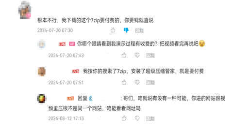

# 安全防范

# **对于防范病毒/担忧中病毒的问题的解答**

对于**电脑用户**，写在最前面：下软件尽量从**官方途径**下载，这是避免中毒的首要办法！**详细方法请[点击观看此视频](https://qr10.cn/AtDGpJ)**，不要嫌长，可以**适当开倍速**观看，**看完基本不用担心下到假软件了，能避免遇到现在流行的很多电脑病毒**

下图便是一个没有掌握这一知识的可悲例子（悲）

PS：其实像这样下到冒牌收费软件还不算什么，就是有亿点气人而已，**如果下载到病毒伪装成的软件安装包才是大问题！**因此，一定要仔细学习上面的视频。

另外，如果你在包括但不限于本文档的地方下载软件，出现**电脑浏览器阻止下载、打开后被阻止**等情况，请[点击观看这个视频](https://www.bilibili.com/video/BV1bt4y1L7dw)

下面是针对特定类型病毒的一些防护方案或对一些担忧、疑惑的解答：

[点了未知链接，装了陌生软件，手机会中毒？此帖解答你的疑惑](https://tieba.baidu.com/p/8874309973)

[安卓手机遇到报毒该怎么做](https://faq.ravenote.top/prevention/basic/7_a_gray_android.html)

[电脑右下角弹出电脑感染XX病毒、立即修复等通知怎么办](https://tieba.baidu.com/p/8495219375)（原帖标题为：《教大家如何识别部分网站的“诱导通知”》）

[如何防范Steam账号被盗](https://faq.ravenote.top/prevention/skill/4_steam_prevention.html)

[如何预防wallpaper engine应用区盗号病毒](https://tieba.baidu.com/p/8598453985)（来自[wallpaperengine吧](https://tieba.baidu.com/f?kw=wallpaperengine&ie=utf-8)）

[个人用户防范勒索病毒的详细方案](https://faq.ravenote.top/prevention/skill/2_ransomware_prevention.html)

（补充：对于数据备份，可参考“3-2-1原则”，[点击此处查看](https://sspai.com/post/39591)）

[防范勒索病毒和窃密木马的方案（使用HIPS来保护文件）](https://www.bilibili.com/video/BV18H4y1C76p/) 

[收到电子邮件，有人说，说是给电脑下了毒，咋办？来看看这个帖子](https://tieba.baidu.com/p/8989356547)
