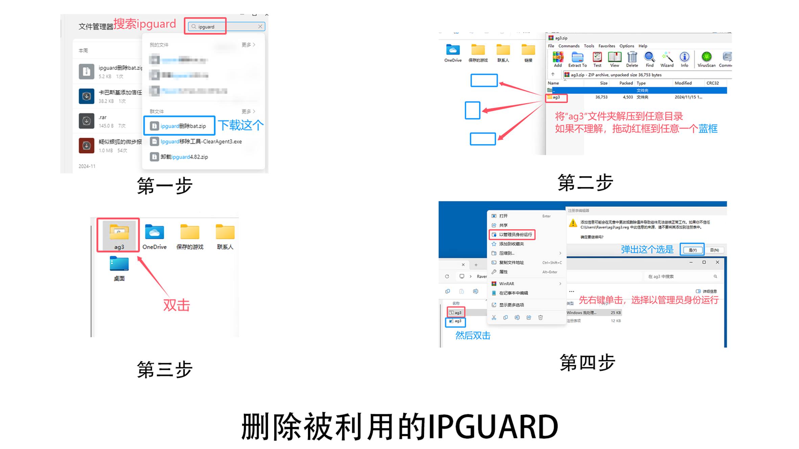
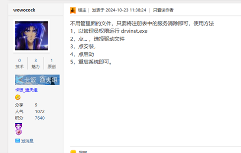
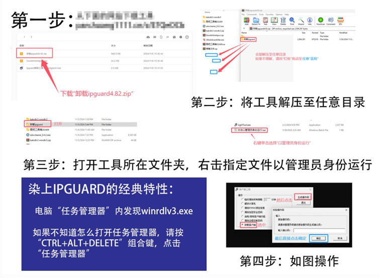
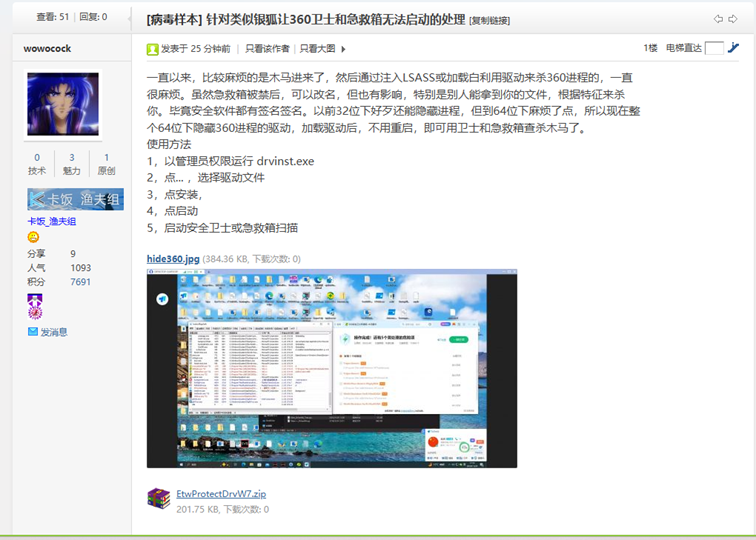

# 中毒急救

**中电脑病毒后的处理方案（持续更新）**

使用指南：这里整理了一些常见电脑病毒类型的相关说明，你可以根据每种病毒的“常见现象”来判断你的电脑是否中了下面列出的病毒，如果**确定就是，则可按照那一种的“处理方式”和“注意事项”中的方案进行处理**，以解决问题

## **（1）一些特定类型的恶意程序**
### **a.蠕虫病毒&感染型病毒&感染型宏病毒**

常见现象：

① 在U盘等可移动存储设备中的文件夹变成了应用程序或快捷方式，且通常大小相等。

② 杀毒软件查杀自己的文档文件等。

③ 系统任务管理器中看到Synaptics.exe以及 .\_cache\_xxx.exe 字样进程，路径在 %ProgramData%\Synaptics (C:\ProgramData\Synaptics) 下，设置为受系统保护的隐藏属性。

④ 计算机中原先的可执行文件图标被修改为统一的图标和描述（例如可执行文件描述被修改为"Synaptics Pointing Device Driver")。

⑤ 原先自己创建的普通文档中出现了宏代码安全提示，并且文档被防病毒软件检出。

⑥ 自己原来的文件都被隐藏了。

⑦ 电脑严重卡顿。

⑧ 文件夹选项被禁用。

⑨ 大量htm/html文件尾部出现大量未知代码。例如，出现一个段落有 "VBScript" "DropFileName" "WriteData" "svchost.exe" "4D5A"(PE头Hex) 等。

⑩ 在某些情况下，满足其他特征时，同时磁盘空间突然性大量减少（此条目仅作为性质描述，不作为诊断指针，仅凭磁盘空间减少无法判断是否感染此类威胁）

处理方式：

① 安装优秀杀毒软件**全盘查杀**，确保**清空信任区**，而且要做到**无条件相信杀毒软件**。

（PS：此类病毒**优先建议选择**使用[火绒](https://www.huorong.cn/person)或[360杀毒](https://sd.360.cn/index.html)（后者**需联网**）进行**全盘查杀**，因为处理速度较快）

② 一部分蠕虫病毒，杀毒软件处理完毕后会发现自己的文件全部消失。不用担心，原来的文件只是被隐藏了，请按照以下操作找回文件：首先，进入“文件夹选项”，找的“查看”，设置“显示隐藏的文件、文件夹和驱动器”，然后取消“隐藏受保护的操作系统文件”，最后点击“应用”。不会的话请[点击查看此文档](https://docs.qq.com/doc/DQXd5UEZacGVsbWFQ)中的**“显示隐藏的文件”**来学习

注意事项：

① 一部分蠕虫病毒是通过隐藏原先正常文件，然后使用恶意文件替换原先正常文件的方式进行传播，也就是说原来的文件并没丢失，请不要动不动就觉得杀毒软件在删除自己原来的文件。

② 一部分感染型病毒通过修改原先正常文件的PE文件结构，使其指向恶意代码。通常情况下，防病毒软件会尽可能清除和修复被病毒感染的文件，请不要动不动就觉得杀毒软件在删除自己原来的文件。

**PS. 此类威胁对于不同的防病毒软件，清除能力、修复能力和识别能力可能有所不同。同时，感染型病毒也具有多种家族，不同的防病毒软件对不同家族感染型病毒的查杀效果可能有所不同。**

③ 使用防病毒软件查杀时请务必**清空信任区**，此类威胁具有较强的传播能力。只要留下一个没有被处理掉，就有可能会再一次感染成百上千个文件。

可参考以下资料：

[我的U盘文件变成了应用程序或快捷方式该怎么办](https://www.huorong.cn/document/tech/safety-classroom/1720)

[“正常文件”被频繁报毒？当心是感染型病毒](https://bbs.huorong.cn/thread-62229-1-1.html)

[百万级感染量 感染型病毒猖狂在哪里？](https://bbs.huorong.cn/thread-85256-1-1.html) 

### **b.盗号木马**

常见现象：

① QQ号莫名其妙被提示异地登录、QQ空间莫名其妙出现异样说说等。

② 邮件大量提示Steam产生交易 / Steam异地登陆 

③ Steam上有好友给你发送CSGO或其他游戏的竞赛消息，要求你点击链接登陆给战队投票，可以抽饰品

④ 网吧适用：拖动WeGame/Steam登录框显示异常，账号密码输入处无法跟随窗口流畅移动

⑤ 在小红车（Wallpaper Engine）中下载的游戏被报毒或游戏文件夹/压缩包内诱导关闭杀毒软件

处理方式：

① 首先要保证安装一个优秀杀毒软件，进行**全盘查杀**，并**无条件相信**杀毒软件的检测结果。

② 如果是Steam被盗：更改密码，重置Steam API Key和Steam登陆凭证（SSFN），换绑并启用手机令牌，清空电脑上所有浏览器Cookies和缓存。

③ 如果是QQ邮箱等被盗：更改密码，设置QQ邮箱独立密码，在修改密码后**在计算机网页重新登录一遍**QQ空间等。

注意事项：

相关资料：

[QQ大盗 - 巧用clientkey](https://www.cnblogs.com/aucy/p/9090900.html)

[Steam被盗号等帐户问题解决方案](https://tieba.baidu.com/p/7946878315)（来自[steam吧](https://tieba.baidu.com/f?ie=utf-8&kw=steam&fr=search)）

[Steam被盗号病毒卖完库存后的补救](https://www.bilibili.com/read/cv26753698)

### **c.远程控制**

常见现象：

① 鼠标键盘不受控制，自动打开任务栏并**启动移动通讯工具**（包括但不限于：微信、QQ等），目的性地打**开聊天对象**（包括但不限于：有目的性地挑选并打开人数较多的群聊），**发送诱导性的消息**（包括但不限于：自动发送可疑文件/二维码）。

② 电脑无缘无故被弹出未知的聊天框，在该聊天框中可以与特定的未知的人员进行聊天通讯。

③ 在排除鼠标、键盘、扫描枪等外置输入设备的前提下（拔出或禁用鼠标、键盘、扫描枪等设备进行确认），计算机**鼠标指针自动移动**，且自动执行**有明显目的性的行为**，**断开网络时该行为消失**。

④ 电脑上传流量异常增加/网速很慢/电脑严重卡顿/特定的、未知的程序**占用高资源**。

⑤ **防病毒软件无法启动。**

⑥ 防病毒软件提示计算机对外发起攻击或连接至僵尸网络，或者查杀到你从来没有下载过的文件。

⑦ 防病毒软件在 %Public%(C:\Users\Public公用目录) 或 %ProgramData%(C:\ProgramData) 等可疑/敏感目录下查杀到可疑的可执行文件，并且你并不知道这些文件是什么。

处理方式：可以先使用当前所有的杀毒软件，**清空杀毒软件的信任区**进行查杀。如果**杀毒软件无法正常启动**/扫描无结果/仍旧有异常，请使用本文档**第八部分的急救工具**之一进行急救。

注意事项：

① 360系统急救箱需要勾选强力模式并联网查杀。文档第八部分的急救工具都需要联网使用。

② 若360急救箱无法正常运行，可以尝试运行急救箱目录下的提示文件，如“如果急救箱打不开请点我.com”等，同时进群寻求帮助。

相关资料：[小白不小心打开陌生人发的远控木马时可以这么做](https://www.bilibili.com/video/BV1yP411U7Tz)（注：现在的许多远控木马也成为了顽固木马，如果遇到杀毒软件无法打开的情况，请按照下文的“（2）顽固木马”处理）

[关于针对我国用户的“银狐”木马病毒出现新变种的预警报告](https://www.cverc.org.cn/head/zhaiyao/news20241122-yinhu.htm)

### **d.破坏型程序**

此类别包括但不限于：

- 敲竹杠（用户锁）
- MBR锁
- 文件加密型勒索病毒（通常留下勒索信并索要比特币等加密货币）
- 删除系统文件/系统注册表的Destroyer或System Killer (Windows Killer)
- 禁用命令提示符、禁用注册表编辑器、禁用安全模式等的Disabler

常见现象：

① 计算机被锁：计算机启动后账户密码被改，或出现黑屏红字（包括但不限于：要求添加指定QQ账户并进行敲诈勒索）、出现彩虹猫等等，并且无法正常加载或进入系统。

② 文件被加密：计算机中的文件都被修改为了统一的未知拓展名，无法打开，选择一个不重要的文件将拓展名手动修改回去同样也无法打开，并且大量目录中出现了类似于 "readme.txt" "readme.hta" 等名称的勒索信文件，可能伴随桌面图标被修改。

③ 系统无法正常使用，提示缺少文件/桌面无法正常启动/无法打开任务管理器等系统组件。

处理方式：

电脑被锁的解决方式请看：[【电脑被锁】计算机锁机的一般通用解救方法](https://www.bilibili.com/opus/424369724066473447)

若不会操作其中具体步骤，请看这个文档中的相应内容：[Windows常见操作图解](https://docs.qq.com/doc/DQXd5UEZacGVsbWFQ)

关于勒索病毒：安装优秀杀毒软件清理病毒，文件一般只能放弃，因为文件的内容已经被修改，无法还原。如果有重要数据，可以尝试进群寻求帮助，查看是否有解密可能性。

### **e.广告流氓程序**

常见现象：

① 广告弹窗

② 无法正常卸载该软件

处理方式：[点此查看视频版处理步骤](https://www.bilibili.com/video/BV1Xc411s7Yi)（注：其中使用卡巴斯基病毒清除工具的教程请[点击这里查看](https://tieba.baidu.com/p/9201137970)，忽略视频中的相关内容。下面为文字版处理步骤。

首先将计算机的杀毒软件换成卡巴斯基或ESET，因为这些杀毒软件处理广告下载器很强。用以上杀毒软件处理过后，搜索softcnkiller，下载后先更新softcnkiller的数据库，再扫描，最后处理全部。如果已经被安装了一些多余的应用，请手动使用“控制面板->程序与功能->卸载程序”进行卸载；win10及以上请通过“设置->应用->卸载应用”卸载。

如果遇到360安全卫士/金山毒霸/WPS等此类正规软件无法卸载，请前往软件官网下载最新版安装包，覆盖安装后再尝试卸载，卸载后访问%Temp%文件夹，清空文件夹下的所有文件。

注意事项：下载软件请前往官网下载，尽量不要使用第三方下载站，第三方下载站下载请注意辨别下载器和正常下载链接。**详细方法参考“7”中给的视频**

补充：对于吧内出现的“经常弹出Edge或其他浏览器推送的通知”等现象，该原因不是由广告流氓程序造成，而通常是用户在访问境外陌生网站时遇到的恶意广告向浏览器申请通知权限。网站通知权限请在对应浏览器的通知设置中关闭。

相关文档：

[在 Microsoft Edge 中管理网站通知](https://support.microsoft.com/zh-cn/microsoft-edge/在-microsoft-edge-中管理网站通知-0c555609-5bf2-479d-a59d-fb30a0b80b2b)

[电脑右下角弹出电脑感染XX病毒、立即修复等通知怎么办](https://tieba.baidu.com/p/8495219375)（原帖标题为：《教大家如何识别部分网站的“诱导通知”》）

补充：如遇访问正常网站跳转到广告网站的情况，请修改DNS为119.29.29.29、223.5.5.5[点此查看修改DNS教程](https://cloud.tencent.com/document/product/302/110786#e13e0d14-191a-4a75-943a-63a67bd4f3f2)

## **（2）个别特殊的名称\开发者的恶意程序**
### **a. Ipguard系列远程控制**

注意 此内容仅供修复被“银狐”等木马程序植入远程控制的设备使用。如将此内容用于非法用途，病毒吧全体成员不负任何法律责任。 本部分资源来自网络收集，版权争议与病毒吧无关，如有侵权，请联系我们删除相关链接，我们将予以真诚的道歉。

说明：IP-guard是由溢信科技股份有限公司一款通用的内网安全软件，其拥有信息查询、远程控制、实时监控等功能。IP-guard本身是一个合法的用于内网的软件，但因为其可以不经过被控方授权就可以远程控制被控方的特点，被黑客滥用于入侵其他计算机；又因为其本身为合法软件，各个安全公司往往对IP-guard的任何行为都不进行管制，导致受害者在使用反病毒软件进行急救时，根本无法将IP-guard连根拔起。

**简单来说，这就是合法软件被恶意利用了**

常见现象：

① 屏幕出现**“Remote Controlling”**的提示字样。

② 火绒安全软件报告“...winrdlv3...”为威胁文件，或报告病毒名称为“Exploit/Winrdlv3”

③ 任务管理器内发现名为**winrdlv3.exe**的进程.

④ C:\Program Files\Common Files\System 目录下存在**winrdlv3.exe**

处理方式：

首先安装**优秀杀毒软件全盘查杀**或者使用**扫描器**对系统进行扫描，

然后**选择下列方案中的一个处理。**

    温馨提示：如果点击进入下列方式中的某个工具的下载地址后，出现下图所示情况，请点击“继续访问”。再次弹窗询问时，请点击“**确定**”。我们保证这个下载地址是安全的，但如果点击链接后跳转到
    “广告界面”，请发帖或加群告诉我们，谢谢！

    如果在下载工具时，出现**电脑浏览器阻止下载，打开后被阻止**等情况，<a href="https://www.bilibili.com/video/BV1bt4y1L7dw" target="_blank" style="color: blue; text-decoration: none;">
    点击观看这个视频
</a>

**方案一:（进病毒吧群聊下载所需文件后，按照下文内容操作）**

提示： 
弹窗提示“找不到指定的文件”是正常情况，没有“拒绝访问”就行 
打开reg导入，提示“成功完成”也行 

**方案二：**

[点此下载“DowithWinhlpsvr.zip”](https://mc163.lanzoue.com/iGCCC2fuujah), [或者点此下载（需登录）](https://share.weiyun.com/K8eR3v6w)并解压，然后按照下图指示操作。

（不会解压？[点击这里，回到文档前面对应部分学习](./index.md)）

**方案三：**

[点击此处转到下载页，根据说明进行下载](https://qr10.cn/B7o9j8)然后按照下图从第二步开始操作

**处理完毕后，如果有时间请[点击链接](https://www.wjx.cn/vm/eiBRVGF.aspx)填写问卷。您的举手之劳将帮助更多人，非常感谢。**

## **(3）顽固木马**
如果计算机遭到**顽固恶意程序（如Rootkit等）**的攻击（常见现象：中毒后无法正常安装/运行杀毒软件，浏览器主页被篡改且任何操作都无法修复等），请使用应急工具对设备进行急救。以下是各种急救工具的下载地址，你可以按顺序尝试，直到问题解决。（红色标注的需要**额外的U盘**作为载体，绿色标注的则可以直接运行在中毒的系统上）：

### A：卡巴斯基病毒清除工具
（建议**全程联网**使用，扫描之前**须设置扫描范围为全盘**。扫描完毕后，先点击上方的“Neutralize all”，再点击“Continue”）：

[点此下载卡巴斯基病毒清除工具](https://www.kaspersky.com.cn/downloads/free-virus-removal-tool) 

[点此查看详细使用方法（注意：4楼有补充内容）](https://tieba.baidu.com/p/9201137970)

如果下载速度太慢，你可以尝试从以下链接下载（如失效，请进群反馈）：

- 加速下载镜像链接（密码854384）：<https://share.ravenote.top/>
- 如果你有Gitcode账户，建议通过以下链接加速下载：<https://gitcode.com/Raven95676/Scanner/blob/main/KVRT.exe>

### B：360系统急救箱
（必须**全程联网**，下载解压后双击运行“SuperKillller.exe”，等待更新完成后，勾选**强力模式**后点击“开始急救”）：[点此获取360系统急救箱](https://weishi.360.cn/jijiuxiang/)

（期间如果急救箱弹窗，按照弹窗的提示操作即可。**如果急救箱无法正常运行，请尝试使用解压出的文件夹中的其他文件**，在什么情况下使用请**参照文件名**）

如果尝试后**仍然无法启动**急救箱，请按照此方案处理（[点此下载所需文件](http://985.so/ki985)，解压之后，按照下图中内容操作后，即可正常使用360系统急救箱或360安全卫士进行病毒查杀）

**（[点此查看原出处](https://bbs.kafan.cn/thread-2276261-1-1.html)）**

### C：火绒恶性木马专杀工具
[点击此处获取火绒恶性木马专杀工具](https://bbs.huorong.cn/thread-18575-1-1.html)

使用以上工具处理后，如果不能成功查杀顽固病毒，请再使用下面的方法处理：

### D：FirPE
[点击此处获取FirPE](https://pinco.seewo.com/s/30b70d6635bc4700a86586a0fee68e01)**（按此方法使用它无需U盘）**

下载后打开，点击**“本地安装”**，安装完成后重启系统，开机时会让你在正常系统和PE之间**选择**，及时点击PE即可进入PE。

进入PE后，打开浏览器下载[360杀毒](https://sd.360.cn/)（不是360安全卫士！）或[火绒](https://huorong.cn/person)，安装后打开，**全盘查杀**一遍。（不会操作这一步的话，可以看这个文档中的相应内容：[Windows常见操作图解](https://docs.qq.com/doc/DQXd5UEZacGVsbWFQ)）

问题解决后，重启，选择正常系统进入，之后**再次打开FirPE安装包**，点击**“本地卸载”**即可。

### E：卡巴斯基应急磁盘
（里面也有教程，可能有兼容性问题（比如新点的无线网卡就连不上网），故不优先推荐）：

[点此获取卡巴斯基应急磁盘](https://www.kaspersky.com.cn/downloads/free-rescue-disk)

[点击获取24版卡巴斯基应急磁盘](https://rescuedisk.s.kaspersky-labs.com/updatable/2024/krd.iso)

注意：问题解决后，如果遇到**每次启动计算机有不明未知程序弹出缺失dll文件报错窗口**等问题，可能是由于顽固木马利用的白文件启动项仍然存在导致的，需要通过手动删除相应的启动项（包括但不限于计划任务）等方式来解决，如果不会操作可以**加群求助**，**务必说清楚你是清除顽固木马后遇到此问题**。
